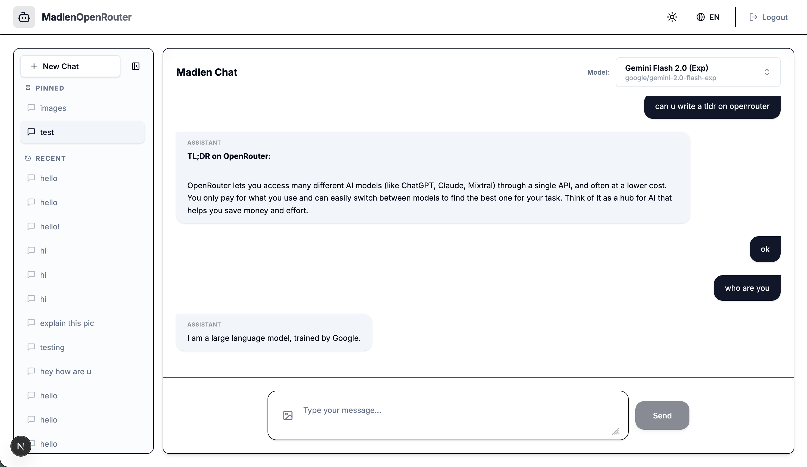

# Madlen OpenRouter Monorepo

> A modern, full-stack AI chat interface powered by OpenRouter, built with Next.js 16, Express, and Turbo.

## 🚀 Overview

This project is a robust, production-ready chat application designed to interact with various LLMs via the [OpenRouter API](https://openrouter.ai/). It features a sleek, responsive UI, multi-modal capabilities (image uploads), full internationalization (English/Turkish), and a microservices architecture managed within a monorepo.

The goal was not just to build a chat app, but to architect a scalable, maintainable system with a focus on **Developer Experience (DX)**, **User Experience (UX)**, and **Robustness**.



## ✨ Key Features

### Core Functionality

-   **Multi-Model Chat**: Seamlessly switch between top-tier models (Gemini 2.0, Llama 3.3, Mistral, DeepSeek, etc.).
-   **Smart Fallback System**: Automatically retries requests with alternative models in the same category (e.g., Reasoning -> Reasoning) if the primary model is rate-limited or unavailable.
-   **Chat History**: Persisted conversations with support for **Renaming**, **Deleting**, and **Pinning** chats.
-   **Authentication**: Secure login via **Auth.js v5** (Credentials provider) with database session verification.

### 🌟 Bonus & Advanced Features

-   **Multi-modal Support**: Upload images to chat with vision-capable models (e.g., GPT-4o Mini, Gemini, Llama 3.2 Vision).
-   **Internationalization (i18n)**: Full English and Turkish support using `next-intlayer` with automatic locale detection.
-   **Advanced Model Selector**: Filter models by capability (Coding, Reasoning, Multimodal) with real-time search.
-   **Observability**: Full **OpenTelemetry** instrumentation for both Frontend (Next.js) and Backend (Express), tracing requests to a local **Jaeger** instance.
-   **Modern UI/UX**:
    -   Responsive Sidebar with toggle.
    -   Dark/Light mode support.
    -   Markdown rendering with syntax highlighting and "Copy Code" functionality.
    -   Fluid animations and accessible components (Radix UI).

## 🛠️ Technical Stack & Architecture

This project uses a **Monorepo** structure managed by **Turbo** and **pnpm workspaces**.

-   **Frontend (`apps/web`)**:
    -   **Next.js 16 (App Router)**: Utilizing React Server Components, Server Actions, and the latest routing paradigms.
    -   **Tailwind CSS v4**: Zero-runtime CSS-in-JS with the latest engine.
    -   **Shadcn/UI**: Reusable, accessible component primitives.
    -   **Playwright**: End-to-End testing.
-   **Backend (`apps/api`)**:
    -   **Express.js**: A separate, robust API service handling business logic and OpenRouter proxying.
    -   **OpenTelemetry**: Distributed tracing integration.
-   **Database**:
    -   **PostgreSQL**: Relational data store.
    -   **Prisma v7**: Type-safe ORM with the latest driver adapters.
-   **Infrastructure**:
    -   **Docker**: Containerized PostgreSQL and Jaeger services.

## 🚀 Getting Started

### Prerequisites

-   Node.js 22+
-   pnpm 10+
-   Docker & Docker Compose

### Installation

1.  **Clone the repository**:

    ```bash
    git clone <repo-url>
    cd madlen-openrouter-monorepo
    ```

2.  **Install Dependencies**:

    ```bash
    pnpm install
    ```

3.  **Start Infrastructure** (Database & Tracing):

    ```bash
    docker-compose up -d
    ```

4.  **Setup Environment**:

    -   Check `.env.example` files in root and apps.
    -   **Important**: You need an OpenRouter API Key. Add it to `apps/api/.env`.
    -   A test user is seeded automatically, or you can run: `pnpm exec tsx packages/database/seed.ts` (inside `packages/database`).

5.  **Initialize Database**:

    ```bash
    # Generate Prisma Client
    pnpm turbo db:generate

    # Push schema to DB
    cd packages/database
    npx prisma db push
    ```

6.  **Run Development Server**:
    ```bash
    pnpm dev
    ```
    -   **Web App**: [http://localhost:3001](http://localhost:3001)
    -   **API**: [http://localhost:3000](http://localhost:3000)
    -   **Jaeger UI**: [http://localhost:16686](http://localhost:16686)

### 🔑 Default Login

-   **Email**: `test@example.com`
-   **Password**: `password123`

## 🧪 Testing

-   **Unit & Integration Tests** (Vitest):
    ```bash
    pnpm turbo test
    ```
-   **End-to-End Tests** (Playwright):
    ```bash
    cd apps/web
    npx playwright test
    ```

## 🔍 Observability

The application is instrumented with OpenTelemetry.

1.  Perform actions in the app (Login, Chat, History).
2.  Open [http://localhost:16686](http://localhost:16686).
3.  Select `web-app` or `api-service` to view distributed traces and performance bottlenecks.

## 📜 License

MIT License. See [LICENSE](LICENSE) for more details.
